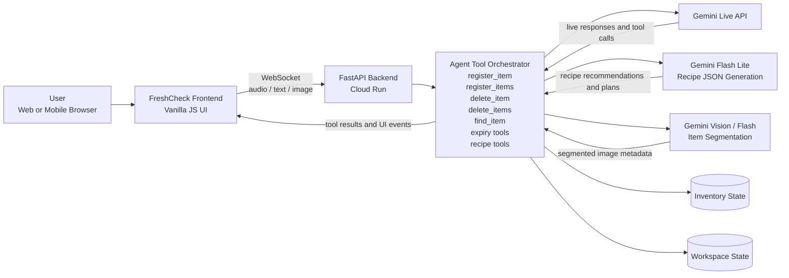

# FreshCheck Live

FreshCheck Live is a real-time AI grocery assistant that sees and hears your fridge.

Users can point a camera at ingredients, speak naturally, and let the assistant:

- register one or many items at once
- ask follow-up questions for expiry dates
- find where ingredients are stored
- delete single or multiple items
- check what is about to expire
- recommend recipes from current inventory
- open detailed recipe plans in the workspace

This project was built for the Gemini Live Agent Challenge as a multimodal, real-time web app with a Python backend and a browser frontend.

## Live Demo

- Public demo: `https://freshcheck-live-1088152672004.asia-northeast3.run.app`

## Key Features

- Real-time multimodal interaction with camera, microphone, and text
- Inventory management through natural conversation
- Batch registration and batch deletion tools
- Follow-up expiry date confirmation flow
- Inventory-aware recipe recommendation and recipe detail generation
- Ingredient card workspace with saved inventory and recipe state
- Korean, English, and Japanese UI/response language selection
- Google Cloud Run deployment

## Project Story

### Inspiration

People forget what is inside the fridge, where ingredients are stored, and what needs to be used first. That leads to duplicate purchases, food waste, and indecision about what to cook.

We wanted to build an AI agent that feels like a real kitchen assistant instead of a text-only chatbot. FreshCheck lets users simply show ingredients with the camera, speak naturally, and get immediate help.

### What It Does

FreshCheck helps users manage groceries and meal planning in real time.

Example tasks:

- "Register everything here."
- "Put these in the fridge."
- "Where is the kimchi?"
- "Delete milk and eggs."
- "What can I cook with what I already have?"

### How We Built It

- Frontend: Vanilla JavaScript, HTML, CSS
- Backend: FastAPI + WebSocket
- Live interaction: Gemini Live API
- Recipe generation: Gemini Flash Lite
- Cloud deployment: Google Cloud Run + Cloud Build
- Persistence: JSON state backed by Google Cloud Storage

### Challenges We Ran Into

- stabilizing real-time audio latency
- handling follow-up turns for expiry dates
- keeping batch tool calls reliable
- preserving inventory and recipe state across refreshes and deployments
- making the UI more product-like under hackathon time pressure

### Accomplishments We Are Proud Of

- a working real-time fridge assistant deployed on Google Cloud
- batch registration and deletion through natural language
- recipe recommendations based on actual stored ingredients
- a persistent inventory/recipe workspace
- multilingual UI and responses

### What We Learned

- multimodal agents need strong tool orchestration, not just good prompting
- live audio systems require aggressive latency control
- follow-up questions are essential when user input is incomplete
- cloud deployment should be prepared early in the build process

### What's Next

- move inventory from JSON storage to Firestore
- move secrets to Google Secret Manager
- improve ingredient segmentation quality
- add OCR-based expiry extraction
- add shared household inventory and proactive reminder flows

## Architecture



## Built With

- Python
- JavaScript
- FastAPI
- Vanilla JavaScript
- WebSocket
- Google Gen AI SDK
- Gemini Live API
- Gemini Flash Lite
- Google Cloud Run
- Google Cloud Build
- Google Cloud Storage
- Docker
- HTML
- CSS
- Pillow
- JSON storage

## Repository Structure

```text
gemini-live-genai-python-sdk/
├─ main.py                    # FastAPI app, websocket session handling, tool orchestration
├─ gemini_live.py             # Gemini Live API wrapper
├─ inventory_store.py         # Inventory persistence layer
├─ workspace_store.py         # Recipe/workspace persistence layer
├─ json_storage.py            # Local/GCS JSON storage abstraction
├─ recipe_generator.py        # Recipe recommendation and detail generation
├─ image_segmentation.py      # Ingredient image segmentation/cropping
├─ deploy_cloud_run.ps1       # Cloud Run deployment script
├─ Dockerfile
├─ requirements.txt
├─ frontend/
│  ├─ index.html
│  ├─ main.js
│  ├─ gemini-client.js
│  ├─ media-handler.js
│  ├─ pcm-processor.js
│  ├─ style.css
│  └─ ui-i18n.js
└─ data/
   ├─ inventory.json
   └─ workspace_state.json
```

## Local Development

### 1. Install dependencies

```powershell
uv venv
.venv\Scripts\Activate.ps1
uv pip install -r requirements.txt
```

### 2. Create `.env`

```env
GEMINI_API_KEY=your_gemini_api_key
PORT=8001
HOST=0.0.0.0
LOG_LEVEL=INFO
```

### 3. Run the server

```powershell
python main.py
```

Open:

- `http://127.0.0.1:8001`

## Cloud Run Deployment

### Prerequisites

- Google Cloud project
- Billing enabled
- Google Cloud CLI installed
- `gcloud auth login`
- `gcloud config set project YOUR_PROJECT_ID`

### Deploy

```powershell
powershell -ExecutionPolicy Bypass -File .\deploy_cloud_run.ps1 `
  -ProjectId YOUR_PROJECT_ID `
  -Region asia-northeast3 `
  -ServiceName freshcheck-live `
  -GeminiApiKey YOUR_GEMINI_API_KEY
```

The script will:

- enable required Google Cloud APIs
- sync persistent JSON state to Google Cloud Storage
- build the container image with Cloud Build
- deploy the service to Cloud Run

## Demo Flow

Recommended demo flow for judges:

1. Open the deployed URL
2. Select a language
3. Start camera and microphone
4. Register multiple ingredients
5. Answer the expiry-date follow-up
6. Check inventory and storage locations
7. Delete one or more items
8. Ask for recipe recommendations
9. Open a detailed recipe in the recipe tab

## Known Limitations

- Persistence is currently JSON-based, not Firestore-based
- Segmentation may fall back to cropped images when a precise mask is unavailable
- The live audio path is optimized for hackathon demo use, not final production voice reliability

## Security Note

- Do not commit `.env` files or API keys
- For a production version, move secrets to Google Secret Manager

